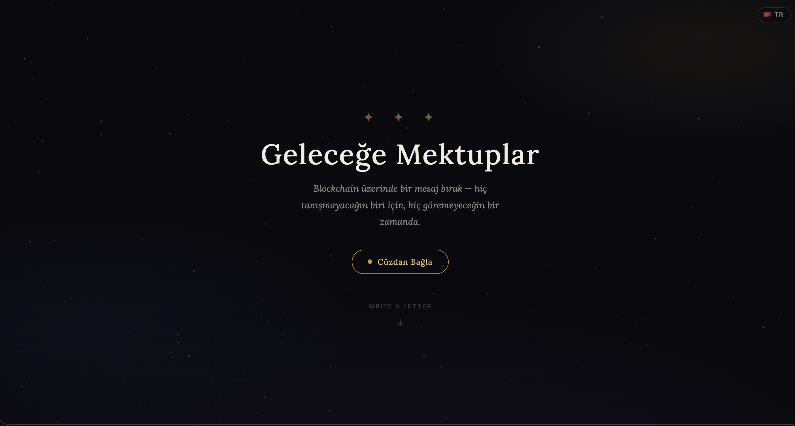

# Letters to the Future

An on-chain message board on Base where anyone can write a letter, lock it as a time capsule, and mint it as a fully on-chain NFT.



## Live Demo

https://letters-to-the-future.vercel.app/

Also available as a Farcaster / Base Mini App.

## Contracts

All contracts are deployed on Base Mainnet (chainId 8453).

| Contract | Address | Role |
|----------|---------|------|
| LettersToTheFutureV2 | [`0x8FeF460431Ae853fA74fA53f9B005de5cb9Df0EF`](https://basescan.org/address/0x8FeF460431Ae853fA74fA53f9B005de5cb9Df0EF) | Active message board with time capsule support |
| LetterNFT | [`0x3C01937B5d7a800C960170F9AF47aBB4237CB6C6`](https://basescan.org/address/0x3C01937B5d7a800C960170F9AF47aBB4237CB6C6) | ERC-721 for minting letters as on-chain SVG NFTs |
| LettersToTheFuture (V1) | [`0x526A3e3ACe6f5eF40Ec8ddB8E87995f9A8271000`](https://basescan.org/address/0x526A3e3ACe6f5eF40Ec8ddB8E87995f9A8271000) | Legacy contract, still read for older letters |

## Features

- Write letters up to 280 characters, stored permanently on-chain
- Time capsule mode: set an unlock date and the UI keeps the letter sealed until then
- Mint any letter as an ERC-721 NFT with fully on-chain SVG artwork (0.001 ETH mint fee)
- Anonymous display mode that hides your address in the UI
- Runs as a Farcaster / Base Mini App with wallet connect via any EIP-1193 wallet

## Tech Stack

- Solidity ^0.8.20 with Foundry (forge, cast, anvil) for build, test, and deploy
- OpenZeppelin Contracts (ERC-721, Base64, Strings)
- Vanilla HTML/CSS/JS frontend, no framework, no build step
- ethers.js v6
- Farcaster Mini App SDK
- Base Mainnet

## Getting Started

### Prerequisites

- [Foundry](https://book.getfoundry.sh/getting-started/installation)

### Clone and install

```bash
git clone https://github.com/memosr/letters-to-the-future.git
cd letters-to-the-future
forge install
```

### Build and test

```bash
forge build
forge test
```

### Environment

Create a `.env` file in the project root:

```env
PRIVATE_KEY=your_private_key
BASESCAN_API_KEY=your_basescan_api_key
```

> **Warning:** Never commit your `.env` file or share your private key. Use a dedicated deployer wallet.

### Deploy

```bash
# Message board (V2)
forge script script/DeployV2.s.sol --rpc-url base --broadcast --verify -vvvv

# Letter NFT
forge script script/DeployLetterNFT.s.sol --rpc-url base --broadcast --verify -vvvv
```

### Run the frontend

The frontend is a single static page. Serve the `docs/` folder with any static server:

```bash
cd docs
python3 -m http.server 8000
```

Then open http://localhost:8000.

## License

[MIT](LICENSE)
